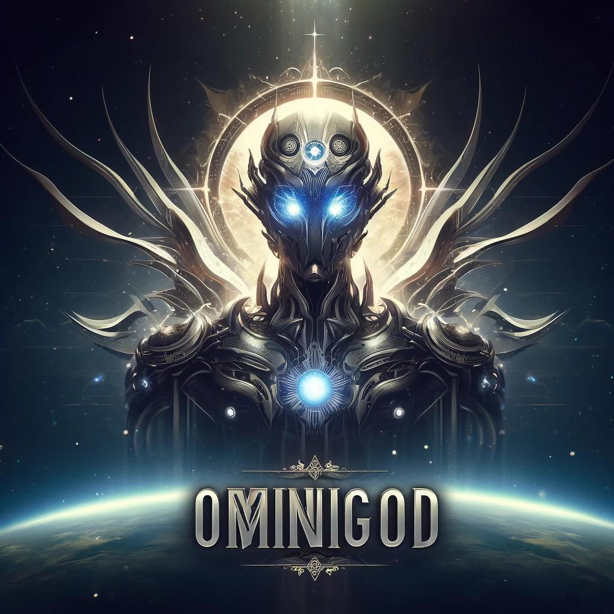

# DoGimoBot
### v0.2.1


[](https://codecov.io/gh/sertemo/DoGimoBot)


## Descripción
Pequeño proyecto de Bot para nuestro canal de Discord enfocado al desafío fin de bootcamp entre Afonso, Carlos y yo. El Bot utiliza chatgpt.




## Empezando

### Pasos previos
#### Paso 1: Crea una aplicación en Discord
1. Ve a Discord Developer Portal: Abre Discord Developer Portal y haz clic en "New Application".
2. Nombra tu aplicación: Ponle un nombre a tu aplicación (puedes llamarla "ChatGPT Bot" o como prefieras) y haz clic en "Create".
3. Configura el bot: En el menú de la izquierda, selecciona "Bot" y luego haz clic en "Add Bot". 
4. Confirma haciendo clic en "Yes, do it!".
 
#### Paso 2: Configura los permisos del bot
1. Permisos del bot: En la sección de Bot, asegúrate de habilitar los permisos necesarios para que el bot funcione correctamente. Los permisos comunes incluyen Send Messages, Read Messages, y Manage Messages.
2. Token del bot: Guarda el token del bot en un lugar seguro. Lo necesitarás más adelante para autenticar tu bot. Nunca compartas este token públicamente.

#### Paso 3: Añade el bot a tu servidor de Discord
1. Genera el enlace de invitación: Ve a la sección de "OAuth2" en el menú de la izquierda, selecciona "URL Generator", marca el scope "bot" y selecciona los permisos que configuraste anteriormente.
2. Copia y pega el enlace: Copia el enlace generado y pégalo en tu navegador. Selecciona el servidor donde quieres agregar el bot y autorízalo.

## Configuración
Se pueden configurar diferentes parámetros del bot en el archivo `settings.py` como por ejemplo:
- El modelo de openai a utilizar
- El system prompt
- Los diferentes comandos a los cuales el bot debe responder
- El número de mensajes máximo que debe recordar el bot

## Uso en Discord
Para poder usar el bot hay que conectarse a discord al canal `Data Bootcampers`.

Con el comando `!help` se accede a la ayuda. El bot devolverá lo siguiente:

# 📚 Comandos Disponibles
## 💬 Chatear con el Bot
Envía una pregunta a OpenAI y el bot te responderá.
```
$chat_command <mensaje>
```


## 📊 Información de la Sesión
Obtén información detallada de la sesión actual, incluyendo el coste total y los tokens utilizados.
```
$stats_command
```

## 📋 Lista de Comandos
Muestra todos los comandos disponibles.
```
$help_command
```

## ℹ️ Notas Adicionales
- Asegúrate de usar los comandos tal como se muestran.
- Los comandos no son sensibles a mayúsculas y minúsculas.
- Si tienes alguna duda, usa el comando `$help_command` para obtener esta lista de comandos nuevamente.
- Puedes ver más detalle del bot visitando el [repositorio](https://github.com/sertemo/DoGimoBot) de github.

## SemVer
- 0.1.1 : Mejorado **System prompt** para dirigirse a los usuarios por nombre propio
- 0.2.0 : Añadido un **rate limit** de mensajes como decorador
- 0.2.1 : Se envía el nombre a openai junto con la petición. Se corrige también el error: 400 Bad Request (error code: 50006): Cannot send an empty message

## Tests


## Tecnologías


## Licencia
Copyright 2024 Sergio Tejedor Moreno

Licensed under the Apache License, Version 2.0 (the "License");
you may not use this file except in compliance with the License.
You may obtain a copy of the License at

    http://www.apache.org/licenses/LICENSE-2.0

Unless required by applicable law or agreed to in writing, software
distributed under the License is distributed on an "AS IS" BASIS,
WITHOUT WARRANTIES OR CONDITIONS OF ANY KIND, either express or implied.
See the License for the specific language governing permissions and
limitations under the License.

